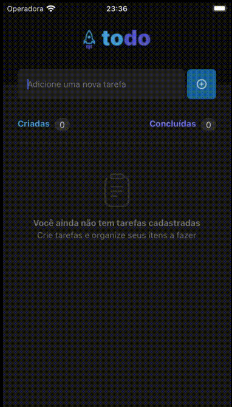

# TODO
### Organize your tasks



#### Technologies used:
- Expo 6.0.5
- ReactJS 18.0.0
- React Native 0.69.4

#### Getting started
- Install Expo v6.0
- Clone repo
- Enter in project folder
- Run ```yarn``` or ```npm install```
- Run ```expo start```
- Choose your emulator
_(A = Android Emulator, I = IOS emulator (macOS only), W = WEB Emulator)_